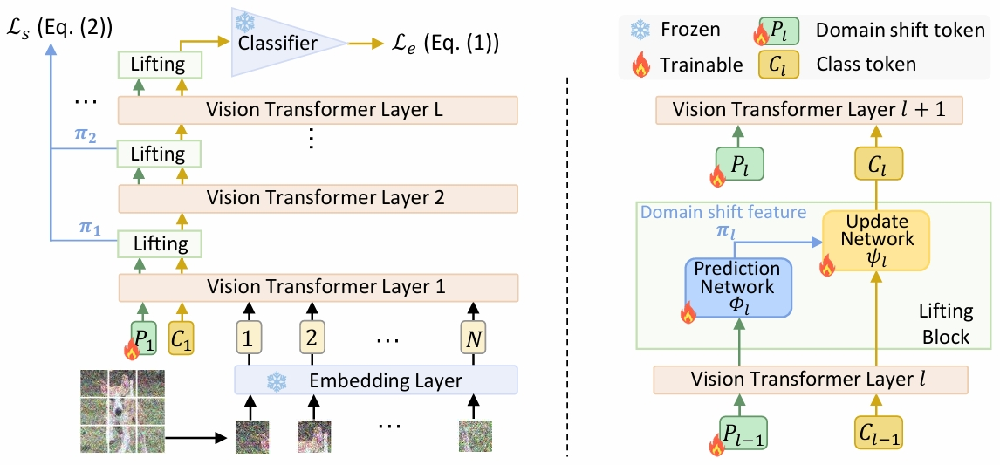

# Dual-Path Adversarial Lifting for Domain Shift Correction in Online Test-time Adaptation

This is the official project repository for [Dual-Path Adversarial Lifting for Domain Shift Correction in Online Test-time Adaptation]. This repository is built based on the [SAR 🔗](https://github.com/mr-eggplant/SAR).

<p align="center">

</p>


**Installation**:

DCT depends on

- Python 3
- [PyTorch](https://pytorch.org/) = 1.9.0
- [timm](https://github.com/rwightman/pytorch-image-models)==0.6.11


This repository contains code for evaluation on ImageNet-C, ImageNet-R, ImageNet-A, and VisDA-2021 with ViT. The pre-trained ViT-B model weights are from [timm 🔗](https://storage.googleapis.com/vit_models/augreg/B_16-i21k-300ep-lr_0.001-aug_medium1-wd_0.1-do_0.0-sd_0.0--imagenet2012-steps_20k-lr_0.01-res_224.npz).

**Usage**:

```
bash run.sh
```

## Acknowledgment
The code is inspired by the [Tent 🔗](https://github.com/DequanWang/tent) and [SAR 🔗](https://github.com/mr-eggplant/SAR).
